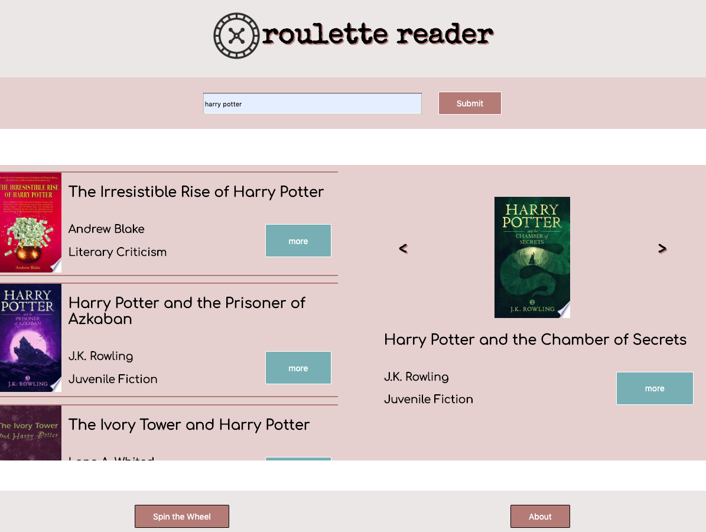

# Roulette Reader

## Table of Contents
* [Introduction](#introduction)
* [Live Link](#live-link)
* [Technologies](#technologies)
* [Getting Started](#getting-started)
* [User Stories](#user-stories)
* [Examples of Use](#examples-of-use)
* [Project Status](#project-status)
* [Unsolved Issues](#unsolved-issues)

## Introduction

Roulette Reader uses Google Books API to generate a list of 10 suggestions based on the keyword entered. Users can select books from the list generated and save them in a carousel, and cycle through them when looking for a title to read. Users can also "spin the wheel" and generate a random list of suggestions if they're in the mood to take a chance.

## Live Link
http://caducus.github.io/roulette_reader/

## Technologies
* HTML/CSS
* Javascript
* jQuery 3.4.1

## Getting Started
1. Fork the repo and clone it to your local machine.
2. Open the index in your browser.

## User Stories
* As a user, I should be able to type in a keyword. My keyword should bring up an appropriate selection of book cards.
* As a user, I should be able to scroll through these cards. When I click on "More", I should be given a brief summary of the plot.
* As a user, when I click on the book cover, it should move the entire book card to my carousel.
* As a user, when I click on the arrows to either side of the cover in my carousel, I should be able to cycle through all books that I have chosen.
* As a user, when I no longer want a book in my carousel, I should be able to click the book's cover again to discard it.
* As a user, when I click "Spin the Wheel", I should be given a selection of book cards based off of a random search.
* As a user, when I click "About", I should be taken to a modal that displays the apps basic functionalities. When I click "close", the modal should disappear.
* As a user, when I resize my browser to a smaller window, or when I view the app on my phone, its design should be responsive and easily visible.

## Project Status
This project is currently complete, and will not be updated in future.

## Unsolved Issues
Presently, this app is not connected to a database. There is no way to save and store a user's information for future visits, or even after a page refresh.
